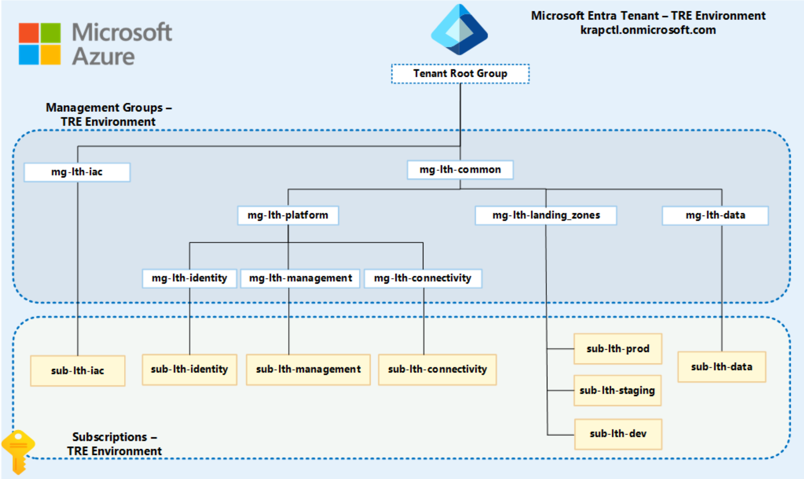
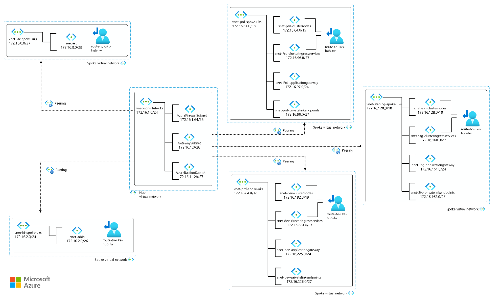

# Hub-spoke Landing Zone

The K8TRE-Azure IaC project requires a pre-existing landing zone ecosystem with a baseline set of resources that include specific Azure subscriptions, security policies and networking topology including private VNET peers, NSGs and subnets. Note, this landing zone ecosystem is tailored to organisational needs of LTH and is provided as a reference implementation to enable the deployment of the K8TRE-Azure IaC project.

Management Group & Subscription Design

Hub-Spoke Network Topology

