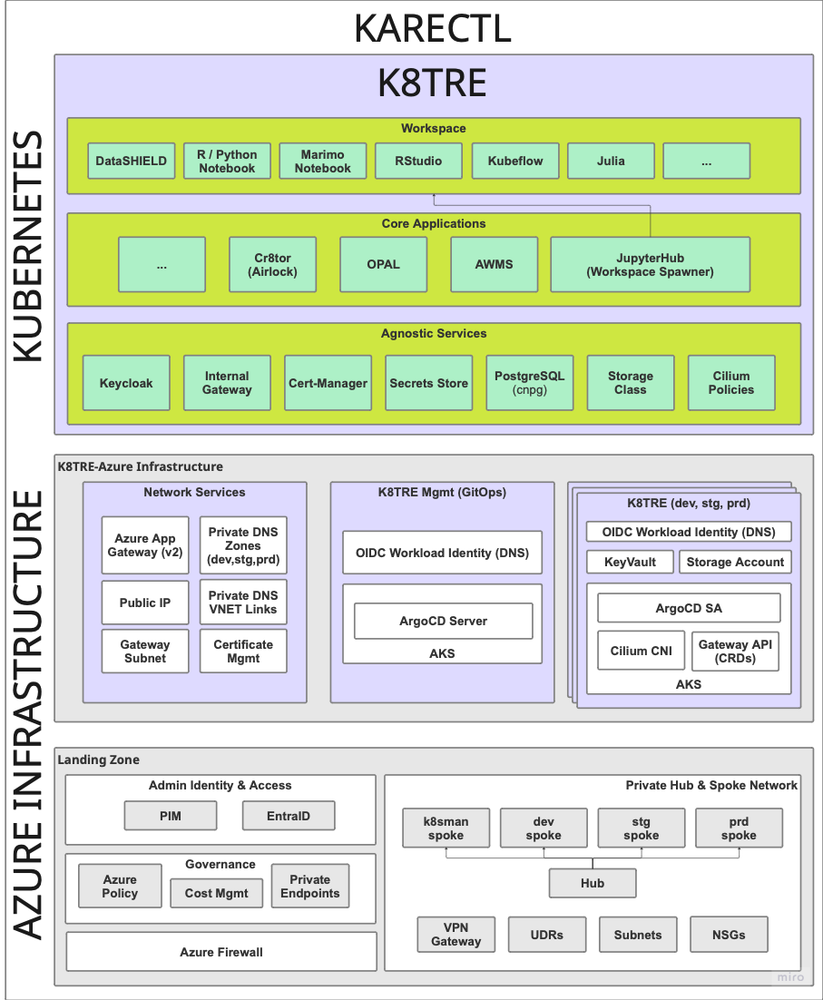
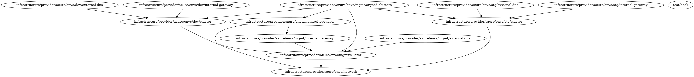

# K8TRE Infrastrucutre Guide

## Overview

As a K8TRE prerequsite, a base infrastructure must be provisioned that incorporates a small number of resources required to operate K8TRE within your organisation:

- **CNCF Kubernetes Distribution**
    - Private cluster configuration
    - Secure compute (nodepool)
- **Networking**
    - L4 & L7 (Application Layer) traffic routing
    - Private & public DNS management
    - Hub-spoke topology
    - K8s control plane & nodepool private endpoints
    - Restricted public ingress (Public Gateway) 
- **ArgoCD** for managing the provision of K8TRE K8s services     
- **Storage** to support secure workspaces and core shared services

This guide provides early details of a reference infrastructure developed by LTH for operating K8TRE on Azure Cloud.

!!! warning
    This IaC project is in alpha-stage development and is designed to support the deployment of [K8TRE MVP](https://github.com/k8tre/k8tre) on Azure. Beware, K8TRE-Azure IaC requires a specified hub-spoke landing zone designed for LTH requirements.
 
### KARECTL
KARECTL represents LTH's implementation of K8TRE within the organisation's existing digital ecosystem. KARECTL comprises three layers: 



- **Landing Zone** - represents a landing zone in Azure based on a hub-spoke design pattern that provides a private networking topology, governance (i.e. EntraID, Azure Policy) and key security (i.e. Azure Firewall) resources. For more information, see [here](landing_zone.md).

- **K8TRE-Azure Infrastructure** - provides Azure-specific and in-cluster resources (e.g. AKS, ArgoCD, Cilium BYO CNI) required to enable the deployment, operation and continued development of K8TRE. In particular, KARECTL implements K8TRE following a promotion-based development and deployment pattern to better support continuous integration and delivery (CICD) processes for TRE developers.

- **K8TRE** comprises K8TRE's in-cluster agnostic services (e.g. DNS, storage, TLS management) and core applications (i.e. jupyterhub, cr8tor) that are deployed and maintained via a declarative GitOps approach based on ArgoCD's management cluster model (however it is also possible to deploy K8TRE following a ArgoCD per Cluster model). Note that organisation's are expected to fork the [K8TRE repository](https://github.com/k8tre/k8tre) and configure a chosen ArgoCD instance as its primary repository.

### K8TRE-Azure Infrastructure
A recipe for the infrastructure resources required to deploy K8TRE MVP on Azure is provided [here](https://). The IaC (Terragrunt/Terraform) deploys K8TRE dependent resources within the underlying 'landing zone' set up at LTH. Following a Terragrunt stacks approach to organise and manage Terraform modules (resources) that have dependencies between them, the project deploys three core stacks of resources:
- The **Network Services** stack provisions specific networking resources (e.g. Azure App Gateway, Private DNS Zones, Public IPs) that must be established prior to provisioning K8TRE clusters
- The **K8TRE Management** stack creates an AKS cluster that acts as the management control plane for all other target K8TRE clusters (i.e. development, staging, production). It installs ArgoCD and automates the set up of secure connections to all other external K8TRE clusters defined as separate stacks (i.e. see dev, stg and prd stacks in the envs/ directory)
- **K8TRE Cluster** a K8TRE cluster stack signals the creation of a AKS cluster that includes the installation of Cilium as the default CNI, ArgoCD service accounts and Gateway API CRDs. In addition to the AKS cluster, the stack creates supporting resources that include an Azure KeyVault, Storage Account and Application IDs (+ Managed Identities) that allow K8TRE agnostic services (e.g. external-dns) to leverage AKS-enabled OIDC [Workload Identify Federation](https://learn.microsoft.com/en-us/entra/workload-id/workload-identity-federation) to avoid the need for k8s services to manage secrets.

#### Modules & Dependencies
Each stack specifies which of the following terraform modules (and associated resources) are deployed into the Azure landing zone:

- **cluster** deploys AKS clusters with networking, storage, and security
- **cluster-dns** sets up DNS management with ExternalDNS
- **cluster-gateway** configures internal Gateway with Cilium CNI
- **cluster-gitops** deploys ArgoCD with Azure AD integration into management cluster
- **cluster-argocd** configures target k8TRE clusters to be managed by the ArgoCD management cluster
- **infra-network** creates shared networking and external Application Gateway

##### Modules & Resources
This section outlines the high-level resources each module manages. For a full listing of modules and resources see detailed documentation under the Modules tab.

- [Cluster](terraform/modules/cluster/overview.md) module establishes a target private AKS cluster for K8TRE.
    - **Core Infrastructure**
        - Resource Group - Container for all AKS cluster resources
        - User Assigned Managed Identity - Identity for the AKS cluster
    - **Networking & DNS**
        - Private DNS Zone Virtual Network Link (i.e. Links AKS private DNS zone to spoke network)
    - **Private AKS Cluster (via Azure Verified Module)**
        - BYO CNI (i.e. no CNI plugin)
        - Single workload node pool (Standard_D2d_v5)
        - Private DNS zone integration
        - AAD RBAC integration (associated with prerequiste EntraID admin group)
    - **Storage Infrastructure**
        - Azure Storage Account (Two for workspaces and core cluster storage requirements)
        - Role Assignments (i.e. Storage Blob Data Contributor, Key Vault Secrets Officer etc)
    - **Private Endpoints** (for storage accounts + keyvault)
    - **Key Vault** for cluster secrets storage
- [external-dns](terraform/modules/cluster-dns/overview.md) module includes resources to enable external-dns agnostic service in K8TRE to intergate with Azure Private DNS
    - **User Assigned Managed Identity** - For ExternalDNS workload identity
    - **Federated Identity Credential** - Links Kubernetes service account to Azure identity
    - **Private DNS Zone** - Custom domain for the cluster
    - **Private DNS Zone Virtual Network Link** - Links DNS zone to hub network
    - **Role Assignment** - Grants ExternalDNS identity "Private DNS Zone Contributor" permissions
- [cluster-gateway](terraform/modules/cluster-gateway/overview.md) module to support K8TRE agnostic internal gateway service
    - **Gateway API CRDs** - Installation of Custom Resource Definitions for Gateway API (GatewayClasses, Gateways, HTTPRoutes, ReferenceGrants, GRPCRoutes) into the cluster
    - **Cilium CNI (with Gateway API)** installed via Helm Release resource
- [cluster-gitops](terraform/modules/cluster-gitops/overview.md) module deploys argocd into a management AKS cluster
    - **Azure AD Resources**
        - Azure AD Application - ArgoCD application registration with OAuth permissions
        - Service Principal - Service identity for the ArgoCD application
        - Federated Identity Credential - Links Kubernetes service account to Azure AD application
    - **ArgoCD Namespace**
    - **ArgoCD Helm Release** - configured with Azure AD OIDC integration and RBAC policies
- [cluster-argocd](terraform/modules/cluster-argocd/overview.md) module configures ArgoCD to manage external Kubernetes clusters (dev and staging) by creating service accounts with cluster-admin permissions and registering the clusters with appropriate labels for GitOps automation
    - **ArgoCD Clusters** (i.e. dev, stg, prd)
    - **ArgoCD Service** Account, Secret & Role Binding (per managed Cluster)
- [infra-network](terraform/modules/infra-network/overview.md) module creates network infrastructure and an Application Gateway that serves as the external entry point for the k8tre platform across multiple environments
    - **DNS Infrastructure**
        - Private DNS Zone - AKS private endpoint DNS zone (privatelink.uksouth.azmk8s.io)
        - Private DNS Zone Virtual Network Links (2x) - Links DNS zone to hub and IAC spoke networks
    - **Application Gateway Infrastructure**
        - Public IP - Static IP for Application Gateway with domain label
        - Application Gateway - Standard_v2 tier with HTTPS listeners, backend pools, and SSL termination
    - **Azure App Gateway**
        - SSL Certificate - Embedded PFX certificate for HTTPS
        - HTTP Listeners - Dev, staging, and production HTTPS listeners
        - Backend Pools - Target cluster gateways for each environment
        - Health Probes - HTTPS health checks for backend services
        - Rewrite Rule Sets - host header and location rewriting for K8TRE services (e.g. Jupyterhub, DataShield)

##### Dependencies
The project ensures proper dependency management and sequential deployment across each environment within the KARECTL ecosystem.

{ align=left }

## Infrastructure Deployment

### Prerequisites
- Ensure a 'landing zone' is already deployed to an Azure tenant that follows the hub-spoke pattern and resource design implemented by LTH. For more information on LTH's landing zone [see here](landing_zone.md) 

### Configuration
Before applying this K8TRE infrastructure recipe for Azure, first ensure the root.hcl terragrunt file (in the envs/ directory) includes the following global variables:

```bash
locals {
    region                                           = "uksouth"
    cluster_name                                     = "k8tre"
    azure_k8tre_mgmt_cluster_subscription_id         = "6810437b-9cbb-40f4-89d8-a9b98f3de028"
    azure_k8tre_dev_cluster_subscription_id          = "02b2c397-edb6-476f-b3a4-aa63e0621c53"
    azure_tenant_id                                  = "30a82846-a29e-4b6b-af27-9b19418ee1b3"
    azure_k8tre_connectivity_subscription_id         = "443fc06f-050e-4794-83d8-eaeee691d453"
    azure_k8tre_stg_cluster_subscription_id          = "4e83168f-6204-4255-b1c0-9042c6fe5afd"
    azure_k8tre_mgmt_subscription_id                 = "db3e5dae-c030-44df-8205-c512d0195e0e"
    argocd_admin_password                            = "XXX" # Set in Github Secrets  & get via get_env()
    entra_admin_group_id                             = "8495e6fa-3c66-403b-abfe-227062b5d9d0"  
}

generate "backend" {
  path      = "backend.tf"
  if_exists = "overwrite_terragrunt"
  contents = <<EOF
    terraform {
        backend "azurerm" {
            resource_group_name   = "rg-kare-iac-core"
            storage_account_name  = "stkareiacstate"
            container_name        = "tfstate"
            key                   = "${path_relative_to_include()}/k8tre.tfstate"
        }
    }
EOF

}
```

The K8TRE-Azure components are deployed across multiple Azure subscriptions for environment isolation. See the subscription structure defined in the landing zone project [here](landing_zone.md) and set each subscription ID accordingly. Furthermore, this configuration defines a remote Terraform backend for state management stored within a storage account defined within the landing zone layer. Adjust this configuration to your preferred state management approach.

### Installation

- Fork the K8TRE-Azure project to your organisation github (or clone if deploying locally)
- Login to Azure Cloud:
```bash
az login
```
- Ensure your az account has the nessasary roles to access each landing zone subscription. Also note, in the current pre-alpha version K8TRE MVP, references to certain resources (e.g. VNETs) may still have hardcoded references:
```bash
az account list --output table
Name                   CloudName    SubscriptionId                        TenantId                              State    IsDefault
---------------------  -----------  ------------------------------------  ------------------------------------  -------  -----------
sub-kare-data          AzureCloud   ea2c7765-31d3-4c3f-aea3-b491555ac5c1  30a82846-a29e-4b6b-af27-9b19418ee1b3  Enabled  False
sub-kare-dev           AzureCloud   02b2c397-edb6-476f-b3a4-aa63e0621c53  30a82846-a29e-4b6b-af27-9b19418ee1b3  Enabled  False
sub-kare-staging       AzureCloud   4e83168f-6204-4255-b1c0-9042c6fe5afd  30a82846-a29e-4b6b-af27-9b19418ee1b3  Enabled  True
sub-kare-production    AzureCloud   d466592d-46fb-432e-9b10-5fc47c2c5cc9  30a82846-a29e-4b6b-af27-9b19418ee1b3  Enabled  False
sub-kare-k8sman        AzureCloud   6810437b-9cbb-40f4-89d8-a9b98f3de028  30a82846-a29e-4b6b-af27-9b19418ee1b3  Enabled  False
sub-kare-connectivity  AzureCloud   443fc06f-050e-4794-83d8-eaeee691d453  30a82846-a29e-4b6b-af27-9b19418ee1b3  Enabled  False
sub-kare-identity      AzureCloud   960d029d-b784-4cee-b834-6ec1903f968a  30a82846-a29e-4b6b-af27-9b19418ee1b3  Enabled  False
sub-kare-management    AzureCloud   db3e5dae-c030-44df-8205-c512d0195e0e  30a82846-a29e-4b6b-af27-9b19418ee1b3  Enabled  False
sub-kare-iac           AzureCloud   d72c48dc-0c7f-4fac-8ce7-fc451e32632b  30a82846-a29e-4b6b-af27-9b19418ee1b3  Enabled  False
```
- Set the working directory to the envs/ directory in the project that contains the terragrunt configuration stacks:
- Do a dry run to check the current state of your Azure infrastructure (i.e. target landing zone) and terragrunt dependency graph across each stack in envs/:
```bash
terragrunt run --all --log-level trace --non-interactive -- plan
```
- If successful, apply the execution plan:
```bash
terragrunt run --all --log-level trace --non-interactive -- apply
```

### Completion
If you have configured the terragrunt to deploy multiple K8TRE-ready AKS clusters (e.g. dev, stg and prd environments), expect for the apply to complete between 20-25 minutes. Once deployed, verify that the clusters are healthy:
- Get credentials for a deployed cluster e.g.:
```bash
az aks get-credentials --resource-group rg-k8tre-stg-uks-aks --name aks-k8tre-stg-cluster
```
- Verify pods are healthy i.e., particularly cilium pods:
```bash
kubectl get pods -A | grep cilium

kube-system         cilium-envoy-2hhnk                                    1/1     Running   0                 36d
kube-system         cilium-envoy-jr5h2                                    1/1     Running   0                 36d
kube-system         cilium-jwf24                                          1/1     Running   0                 18d
kube-system         cilium-lqz66                                          1/1     Running   0                 18d
kube-system         cilium-operator-598648997c-brvfn                      1/1     Running   0                 36d
kube-system         cilium-operator-598648997c-d9hwx                      1/1     Running   0                 36d
```