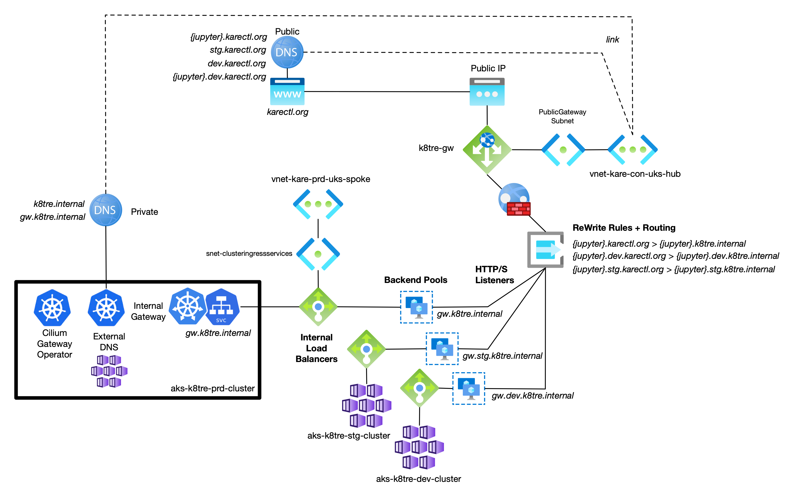

# Public Gateway
K8TRE provisions a cluster [Gateway](https://kubernetes.io/docs/concepts/services-networking/gateway/#api-kind-gateway) instance (cilium-gateway) based on Cilium's Gateway API controller to support inter and intra application traffic routing. Gateway is deployed with an internal loadbalancer K8s Service (cilium-gateway-internal-gateway). For Azure-based deployments, cilium-gateway-internal-gateway is annotated to provision the internal load balancer in Azure on the private VNet AKS is also bound. However, for K8TRE operators that require a public ingress additional infrastructure is required to route traffic from a public source to a cluster's internal gateway (load balancer).

## Azure Application Gateway (v2)
K8TRE-Azure includes the [infa-network](terraform/modules/infra-network/overview.md) module to deploy an Azure Application Gateway (v2) with required HTTPS listeners, routing rules and backend pools for each deployed K8TRE environment (dev, stg, prd). At the K8TRE level, the internal Gateway is annotated with a domain name **gw** relative to each internal private domain zone per K8TRE cluster (e.g. gw.karectl.ord, gw.dev.karectl.org, etc). This allows TRE operators to configure target backend pools in the Application Gateway to allow traffic routing to the relevant K8TRE cluster internal gateway load balancer.

The Azure Application Gateway resource is connected to the hub VNet via 'PublicGateway' subnet and allocated a Azure Public IP resource. The TRE operator, must establish a public DNS zone. For LTH's reference implementation **karectl.org** is registered with an external DNS registrar with DNS records managed externally via LTH's chosen DNS registrar. However, organisations deploying to Azure may also wish to defer control to a public DNS zone resource in Azure that allows for the management of DNS records via Terraform or the Azure Portal. K8TRE-Azure employs a collection of rewrite rules to map public to private domain zones for particular services which require public ingress. For example, HTTPS requests from **jupyter.stg.karectl.org** would be rewritten to **jupyter.stg.k8tre.internal**.

## Internal Gateway Routing
K8TRE services that require Gateway ingress define a host-based [HTTPRoute](https://kubernetes.io/docs/concepts/services-networking/gateway/#api-kind-httproute) that instructs the K8TRE internal Gateway where to route application traffic. The K8TRE **gateway** agnositic component includes default HTTPRoute configurations for services including Jupyter, Keycloak or federated analysis components (e.g. Opal/DataShield).